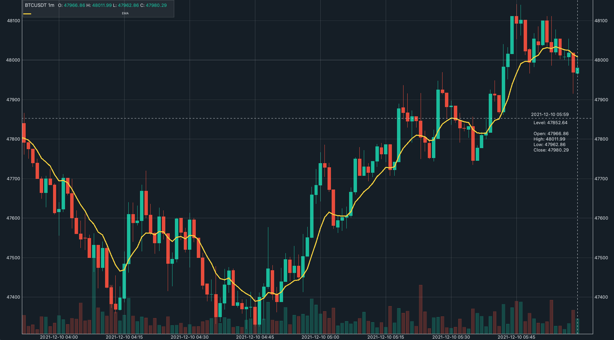

# stack-orderflow

> **Some words:**
> This repo started off as a project for my own needs - there were little to no open source tools about orderflow charting and visualization given how specific it is.
> I am losing motivation on expanding/optimizing this project because coding up desktop GUI using PyQt-related tools feels crazy, especially when comopared to the development experience in JS-ecosystem - I don't really love JavaScript but given how available the community is, it is a lot easier to code up things there. Plus, desktop GUIs feel really old. At the time of writing, I feel more excited to code up webapps/desktop apps with something else. Just not graphic dev with Python.

Orderflow chart desktop GUI using [Finplot](https://github.com/highfestiva/finplot) and [PyQtGraph](https://github.com/pyqtgraph/pyqtgraph).

**Enviornment:**

- Tested with Python3.9+
- Updated to PyQt6

## Plotting

### Dependence on `@highfestiva/finplot` library

The plotting is largely based on the [original Finplot library](https://github.com/highfestiva/finplot), with slight modification in order to allow for orderflow plotting. The whole package source code of his repo is included in this repo (`./finplotter/finplot_library`) because this repo modifies the original package in a hacky way. In the future, this project will be refactored in a way that the inclusion of Finplot package would be unnecessary. Nevertheless in the mean time, it is advised to look into the package itself for further customization.

## Examples

- You may find these examples available in `./examples`.

### Example 01: Simple candlestick plot

### Example 02: Simple candlestick plot with technical indicator panels

### Example 03: Orderflow plot with static data

## To-do
### Example 04: Orderflow plot with real time data streaming
<!--  -->